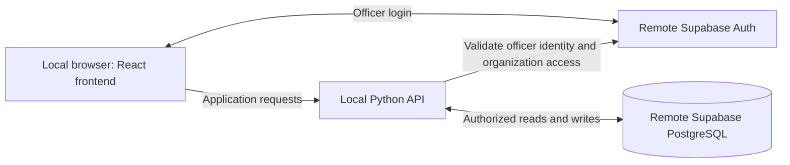

# Architecture and MVP decisions

Updated October 6, 2026. This document records agreed direction and proposed implementation boundaries. It does not claim the product schema, check-in, or deployment already exists. The repository now includes the folder split, Tailwind integration, and a Python health API.

## Chosen stack and development boundary

- Frontend: React, TypeScript, Vite, Tailwind CSS, and React Router.
- Backend: Python 3.13 with FastAPI.
- Database and officer authentication: Supabase PostgreSQL and Supabase Auth.
- Development: frontend and Python API run on each developer’s computer; the shared development database is remote. Officer authentication uses remote Supabase Auth when implemented.
- Deployment: Vercel is the planned host for frontend and Python API. Deployment configuration and runtime limits must be verified when implementing hosting.
- Google Forms/Sheets integration and Supabase Edge Functions are not part of the selected MVP architecture. Native check-in replaces the Google integration.



Public check-in accepts unauthenticated attendee submissions through a narrowly scoped API. It must never expose the roster or grant anonymous database access. Officer operations require verified authentication and organization authorization. Privileged database credentials can bypass Row Level Security; if used, the Python API must explicitly enforce organization boundaries. Never trust a client-supplied organization ID as authorization.

## Repository layout

```text
C.E.O-Dashboard/
  frontend/                 # React app, assets, package files, Vite/TS configuration
  backend/                  # Python API, validation, application logic, tests
  supabase/
    migrations/             # Versioned SQL tables, constraints, indexes, access policies
  docs/                     # Requirements, design, setup, and team planning
  README.md
```

The folder split is implemented. Root npm scripts forward to the frontend; its dependencies and environment files live in frontend/. The backend has an isolated virtual environment and pinned dependency files. SQL migrations define the remote database; Python request/response schemas validate API data and are a separate concern. Inspect the remote schema before establishing an initial migration baseline. Keep secrets out of Git and out of browser-visible VITE_ variables.

The root README reflects this architecture. The earlier Netlify configuration has been removed. Vercel deployment configuration remains an upcoming task.

## Native check-in contract

1. An officer creates an event; C.E.O. generates a stable, unguessable event-specific public link.
2. The event page offers Copy check-in link, Download QR code (PNG), Preview form, and Open/Close check-in. The PNG can be inserted into the officer’s own slides.
3. Attendees submit the organization’s selected identifier, such as RIN or email, without creating accounts.
4. The Python API verifies the event is open, validates and normalizes inputs, and matches only within that organization.
5. A unique match creates confirmed attendance. Unknown valid identifiers create submissions for review; ambiguous matches are never guessed. Invalid input gets validation feedback.
6. Officers can link an unmatched submission to an existing member, create a member and record attendance, or ignore it. Creating a member and recording attendance must be safe to retry.
7. Closing/reopening check-in preserves the link and QR. Closed forms show “Check-in is currently closed”; an already-open browser page cannot bypass the backend check.
8. Officers finalize attendance after review for inclusion in engagement metrics. Closing check-in and finalizing attendance are different actions.

Database uniqueness must prevent multiple attendance records for the same member/event, including simultaneous requests. Basic spam protection should combine generous shared-network limits with per-client controls and bot detection; a browser identifier alone is bypassable. Concrete thresholds and whether a CAPTCHA is needed remain implementation decisions. Do not use one submission per IP: campus users can share an address. Test legitimate bursts and repeated requests. Limit retained submission data and decide its retention period before real use.

The QR encodes the same public link; it contains no member identifiers. Neither a typed identifier nor scanning a shared QR proves identity or physical presence. Stronger identity verification is deferred.

## Data model direction

These are responsibilities and key constraints, not a finalized SQL schema.

| Table | Responsibility and rules |
| --- | --- |
| organizations | Name, identifier matching method/label, currency, engagement percentage threshold, and reporting period dates. |
| organization_users | Officer Auth user → organization access and role. Unique user/organization pair; access rules and invitation process still need agreement. |
| members | Internally generated member ID, organization ID, optional external ID, name, email, club role, join date, membership status. External IDs are text and unique within an organization when present. Email matching requires an agreed normalization and uniqueness rule. Club role is distinct from application access role. |
| events | Organization, name, start date/time, type, description, lifecycle status, public check-in token, open/closed state, and attendance finalization timestamp. |
| check_in_submissions | Event/organization, submitted identifier and necessary review details, received time, matching/review state, and optional matched member. Access restricted to authorized officers. |
| attendance | Confirmed member/event, organization, check-in time, and recorded time. Unique member/event; database relationships must prevent cross-organization links. |
| financial_transactions | Organization, entry kind, exact amount, date, category, description, optional event, creator, and void metadata. Opening-balance representation still needs final schema agreement. |

A roster member does not require a login. One person may have separate roster records in different organizations. Foreign keys, constraints, API authorization, and database policies must enforce organization isolation together.

## Engagement metrics

- Active member: `events attended / eligible events × 100 >= organization threshold` over the organization’s configured reporting period. No fixed threshold is assumed; the earlier 50% value was an example.
- Eligible events: completed, non-cancelled, attendance-finalized events in the reporting period after the member joined. Apply the same denominator rules throughout the app.
- Zero eligible events: show “Not enough data” rather than inactive.
- Membership status (for example, archived/alumni) is stored separately from calculated engagement status. Decide which membership statuses are included in dashboard totals before implementation.
- Most popular events: rank by distinct confirmed attendees.
- Monthly attendance: total distinct-per-event attendee counts divided by the number of eligible events that month. Include finalized events with zero attendance; show “No events” if there are none. Label “Average attendees per event.”
- A person at multiple events counts once at each event. Individual history is derived from confirmed attendance.
- Use an agreed organization reporting timezone for month boundaries and event dates; exact timezone and period-boundary handling remain to be specified.

## Basic finance MVP

Support one currency per organization, an opening balance with effective date, manual income/expense entries, categories, description, optional event association, transaction history, and summary totals. Use exact decimal amounts or integer minor units, never floating-point money. Display the recorded balance based on the opening balance and subsequent non-voided entries; period income/expense totals exclude opening balance. Preserve corrections through void reason, actor, and timestamp rather than deleting history. Confirm opening-balance storage, date boundaries, and finance permissions before SQL implementation.

Bank connections, payment processing, and automated accounting are deferred. The displayed balance is based on entered records, not a verified bank balance.

## Implementation sequence and Jira preparation

These are proposed backlog items, not Jira issues already created. Review existing issues before adding duplicates; the team assigns owners and estimates during planning.

| Task | Acceptance criteria |
| --- | --- |
| Separate frontend/backend and scaffold Python | Local start commands documented; existing frontend checks pass; framework/version selected; secrets remain separate. |
| Review schema and permissions | Relationships, identifier rules, roles, finance permissions, deletion/archival behavior, and metric boundaries agreed. |
| Establish migration baseline | Existing remote schema inspected; migrations reproduce the model using synthetic data; policies and constraints reviewed. |
| Implement native check-in | Valid identifier produces attendance; invalid inputs get feedback; unknowns enter review; roster data stays private. |
| Add stable link and QR export | Copy link and downloadable PNG point to the same event; reopening does not invalidate existing slides; preview available. |
| Add officer controls and unmatched review | Unauthorized actions denied; closed check-in rejected server-side; link/create/ignore actions work safely. |
| Verify duplicates and abuse controls | Concurrent duplicates produce one attendance record; cross-organization links fail; campus-network bursts work; submission limits tested. |
| Implement basic finance | Opening balance, entries, period totals, optional event links, and void history verified with exact amounts. |
| Implement engagement metrics | Configurable period/threshold; zero-event and zero-attendance cases; finalized-event filtering; monthly averages and ranking verified. |
| Prepare Vercel deployment later | After local integration, configure frontend/Python deployment and verify auth, API, check-in, QR links, and finance on deployed URLs. |

Time estimates have not been validated. Prioritize a small working local flow; do not treat rough conversational estimates as sprint commitments.
